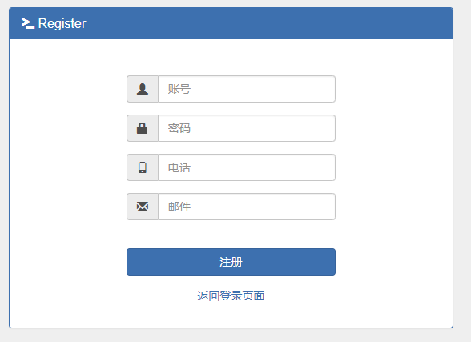
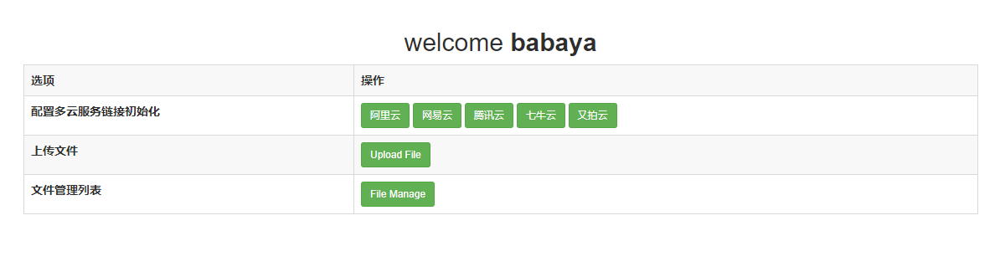
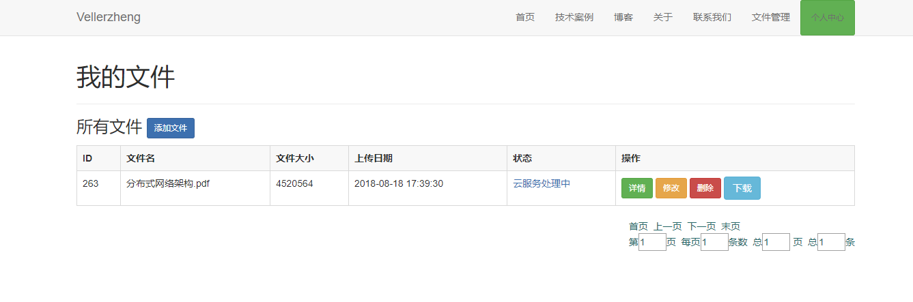

# intelig-storage

##    智能存储

## 说明
    1、由于该项目有很多私有化配置和多种专属密钥 ，所以配置文件没有提供，若有需要请联系vellerzheng2012@163.com。
    2、该版本为重构后的微服务版本 ，详情请参见spring mvc旧版本. 
   https://github.com/vellerzheng/CloudSecuritybackup
## 功能
    
    实现文件切片，加密后上传到多个云服务器。并提供界面化文件管理系统和下载等功能。
    
## 架构
    
    论文提交后给出。

## 技术方案：

    spring boot & cloud 
    mybatis
    mysql
    redis
    rabbitmq
    
### 功能模块

    1.登陆
   
   
    2.注册
   
    
    3.配置云服务
   
    
    4.文件管理
   
    
## reference
 https://blog.csdn.net/qq_27384769/article/details/79096724
 https://blog.csdn.net/qq_27384769/article/details/79080892
 https://blog.csdn.net/forezp/article/details/70148833
 https://gitee.com/lishangzhi2012/springcloud-microservice